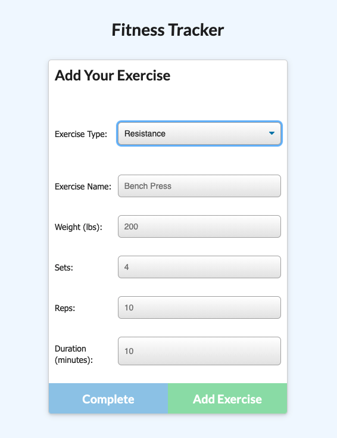

# Workout - Tracker

## Description

Did you gain the Covid 20? I know I did. (Please do NOT be embarrassed to admit it)

Gaining weight is easy but working out is harder. I created an application that allows you to log your exercise by the minute and the day. I find that I feel more motivated to work out when I can see some type of progress. I think you will find it helpful as well. 

Below you will see a few examples of how the application works. Click [here](https://stormy-fjord-73255.herokuapp.com/) to check out the deployed application. 


[](https://opensource.org/licenses/MIT)

## Table of Contents:
* [Installation](#installation)
* [Demo](#demo)
* [License](#license)
* [Tests](#test)
* [Questions](#questions)


## Installation
1) Clone this repositiory to your local computer using terminal or bash:

    ```
    git clone https://github.com/Kammielatay/workout-tracker.git

2) Open folder in your editor of choice (VSC, Sublime, etc.)

## Demo



## License
Distributed under the [](https://opensource.org/licenses/MIT) License. See [OpenSource.org](https://opensource.org/licenses) for more information.

## Tests
1) Select 'Open in Integrated Terminal' by simply right-clicking anywhere on the root file directory and run the code below:

    ```
    npm install
    npm start
    ```

3) Run file on http://localhost:3000/

## Questions
If you have any questions, please reach out to me at Kameshialatay@gmail.com